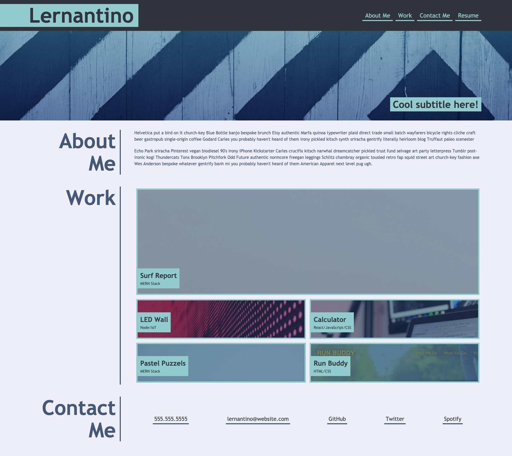
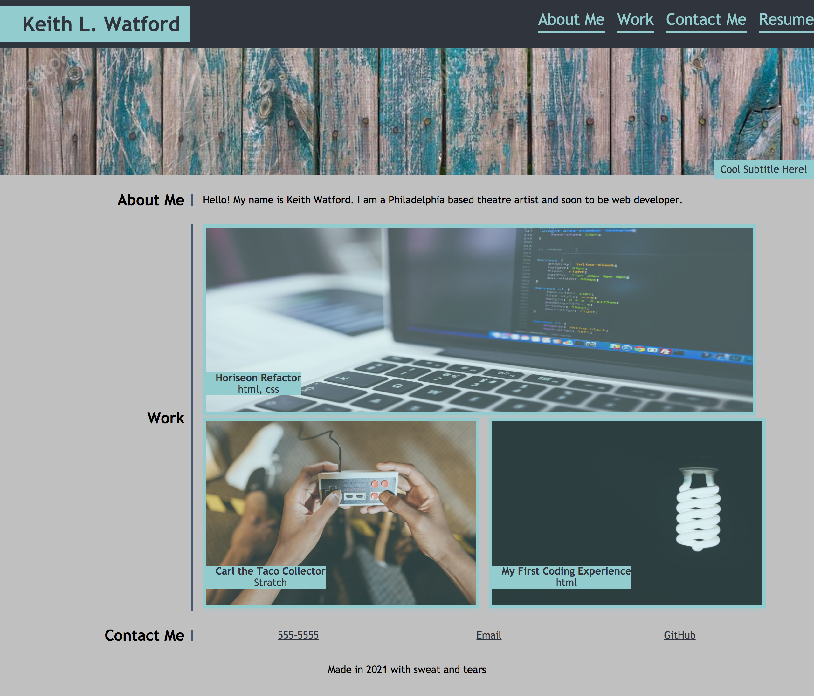

# Portfolio

## Description
 I was assigned to recreate a website from a reference photo. I started this as a challenge to myself to become more comfortable with flexbox. Although I couldnt mimic the way the original website behaves with flexbox, I was able get some of it as well as some of the other elements to work and recreate it's general aesthetic. 

## Table of Contents (Optional)
- [Installation](#installation)
- [Usage](#usage)
- [Credits](#credits)
- [Notes](#Notes)
- [License](#license)

## Installation
No installs required.

## Usage
Access the website by clicking the URL:  https://keith-l-watford.github.io/i-am/

Here's a screenshot of the reference website:

and heres where my recreation currently stands *(as of June 2nd, 2021)*: 

## Credits
Shout out to my tutor Scott, Teacher Lief, and naps.

## Notes
The next time I attempt this I think I will start with a mobile first approach and use media query to size it out for bigger screens. Unfortunately, I was too far along to start over and change my approach. I now have a greater understanding of flexbox and its properties, however, theres still more to work on and utilize. 

## License
This is free and unencumbered software released into the public domain.

Anyone is free to copy, modify, publish, use, compile, sell, or distribute this software, either in source code form or as a compiled binary, for any purpose, commercial or non-commercial, and by any means.

In jurisdictions that recognize copyright laws, the author or authors of this software dedicate any and all copyright interest in the software to the public domain. We make this dedication for the benefit of the public at large and to the detriment of our heirs and successors. We intend this dedication to be an overt act of relinquishment in perpetuity of all present and future rights to this software under copyright law.

THE SOFTWARE IS PROVIDED "AS IS", WITHOUT WARRANTY OF ANY KIND, EXPRESS OR IMPLIED, INCLUDING BUT NOT LIMITED TO THE WARRANTIES OF MERCHANTABILITY, FITNESS FOR A PARTICULAR PURPOSE AND NONINFRINGEMENT. IN NO EVENT SHALL THE AUTHORS BE LIABLE FOR ANY CLAIM, DAMAGES OR OTHER LIABILITY, WHETHER IN AN ACTION OF CONTRACT, TORT OR OTHERWISE, ARISING FROM, OUT OF OR IN CONNECTION WITH THE SOFTWARE OR THE USE OR OTHER DEALINGS IN THE SOFTWARE.

For more information, please refer to http://unlicense.org/